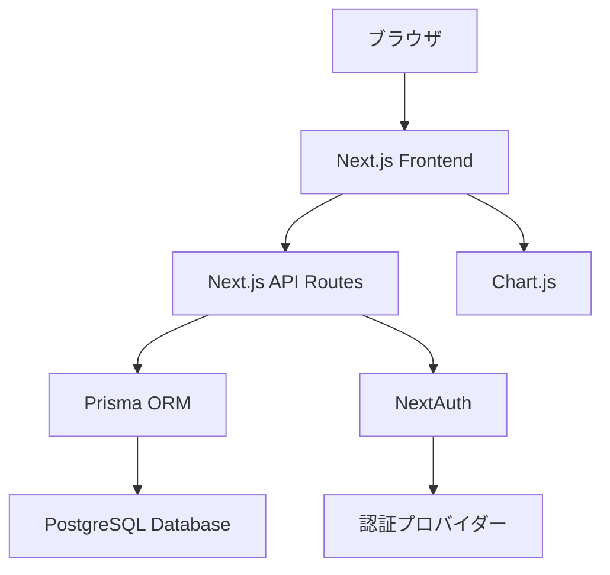
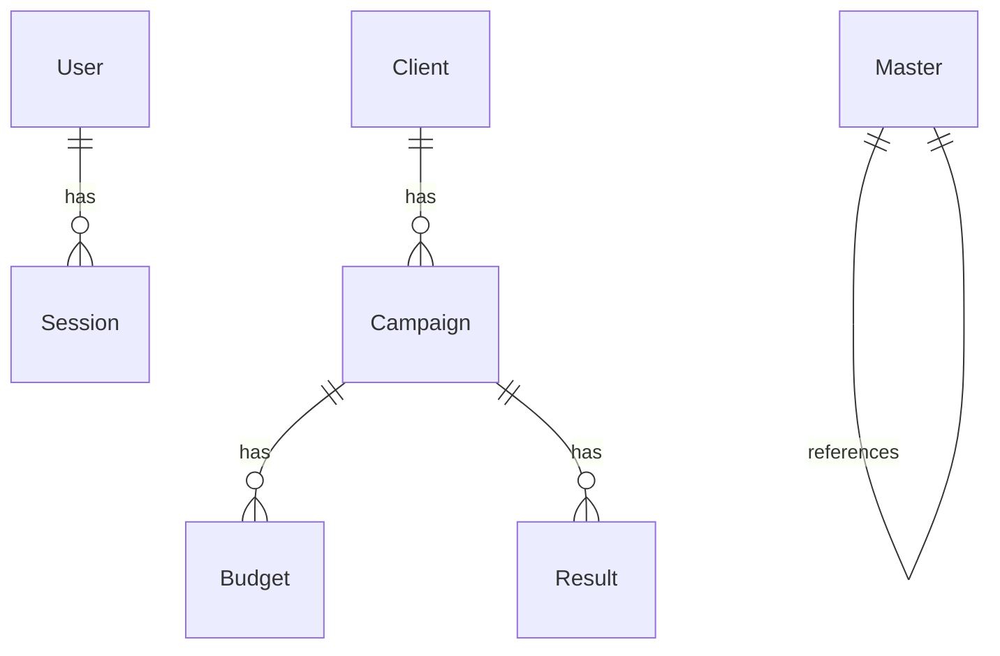

# 設計文書

## 概要

マーケティング支援代理店向け予算管理システムは、Next.js 15のApp Routerを基盤とし、Prisma ORM + PostgreSQLでデータ管理、NextAuthで認証、Chart.jsで可視化を行うフルスタックWebアプリケーションです。50人以下の同時利用者に対応し、リアルタイムな予算・実績管理を提供します。

## アーキテクチャ

### システム構成



### 技術スタック

- **フロントエンド・バックエンド**: Next.js 15 (App Router)
- **データベース**: PostgreSQL
- **ORM**: Prisma
- **認証**: NextAuth v4
- **可視化**: Chart.js + react-chartjs-2
- **スタイリング**: CSS Modules / Tailwind CSS
- **デプロイ**: Vercel
- **言語**: TypeScript

### ディレクトリ構造

```
src/
├── app/                    # Next.js App Router
│   ├── (auth)/            # 認証関連ページ
│   ├── api/               # API Routes
│   ├── clients/           # クライアント管理
│   ├── campaigns/         # 施策管理
│   ├── budgets/           # 予算管理
│   ├── results/           # 実績管理
│   ├── reports/           # レポート
│   ├── users/             # ユーザー管理
│   └── settings/          # 設定
├── components/            # 再利用可能コンポーネント
│   ├── layout/           # レイアウト関連
│   ├── ui/               # UI基本コンポーネント
│   ├── forms/            # フォーム関連
│   └── charts/           # グラフ関連
├── lib/                  # ユーティリティ
│   ├── auth.ts           # NextAuth設定
│   ├── prisma.ts         # Prisma Client
│   └── utils.ts          # 共通関数
└── types/                # TypeScript型定義
```

## コンポーネントとインターフェース

### 認証システム

**NextAuth設定 (`lib/auth.ts`)**
```typescript
export const authOptions: NextAuthOptions = {
  adapter: PrismaAdapter(prisma),
  providers: [
    CredentialsProvider({
      credentials: {
        email: { type: "email" },
        password: { type: "password" }
      },
      authorize: async (credentials) => {
        // bcryptでパスワード検証
        // ユーザー情報とロールを返却
      }
    })
  ],
  callbacks: {
    session: ({ session, token }) => ({
      ...session,
      user: {
        ...session.user,
        role: token.role,
        department: token.department
      }
    })
  }
}
```

### 権限管理システム

**権限チェック関数**
```typescript
export enum UserRole {
  ADMIN = "admin",
  MANAGER = "manager", 
  MEMBER = "member"
}

export function hasPermission(userRole: string, action: string): boolean {
  const permissions = {
    [UserRole.ADMIN]: ["read", "write", "delete", "manage_users"],
    [UserRole.MANAGER]: ["read", "write"],
    [UserRole.MEMBER]: ["read"]
  }
  return permissions[userRole]?.includes(action) || false
}
```

### データアクセス層

**Prisma Client設定 (`lib/prisma.ts`)**
```typescript
import { PrismaClient } from '@prisma/client'

const globalForPrisma = globalThis as unknown as {
  prisma: PrismaClient | undefined
}

export const prisma = globalForPrisma.prisma ?? new PrismaClient()

if (process.env.NODE_ENV !== 'production') globalForPrisma.prisma = prisma
```

### UI コンポーネント設計

**レイアウトコンポーネント**
- `Layout`: 全体レイアウト（ヘッダー、サイドバー、メインコンテンツ）
- `Header`: ナビゲーション、ユーザーメニュー
- `Sidebar`: メニューナビゲーション
- `AuthGuard`: 認証・権限チェック

**データ表示コンポーネント**
- `DataTable`: 検索・フィルタ・ソート機能付きテーブル
- `Chart`: Chart.jsラッパーコンポーネント
- `DashboardCard`: ダッシュボード用カード
- `ProgressBar`: 予算進捗表示

**フォームコンポーネント**
- `ClientForm`: クライアント登録・編集
- `CampaignForm`: 施策登録・編集
- `BudgetForm`: 予算設定
- `ResultForm`: 実績入力

## データモデル

### データベーススキーマ

**ユーザー管理**
```prisma
model User {
  id            String    @id @default(cuid())
  name          String?
  email         String    @unique
  password      String
  role          String    @default("member")
  department    String?
  isActive      Boolean   @default(true)
  createdAt     DateTime  @default(now())
  updatedAt     DateTime  @updatedAt
}
```

**ビジネスデータ**
```prisma
model Client {
  id          String @id @default(cuid())
  name        String
  manager     String
  priority    Int
  campaigns   Campaign[]
}

model Campaign {
  id          String @id @default(cuid())
  clientId    String
  name        String
  purpose     String
  startDate   DateTime
  endDate     DateTime
  totalBudget Decimal
  client      Client @relation(fields: [clientId], references: [id])
  budgets     Budget[]
  results     Result[]
}

model Budget {
  id           String @id @default(cuid())
  campaignId   String
  year         Int
  month        Int
  platform     String      # X, Instagram, YouTube, TikTok, Threads
  operationType String     # マイクロIF, メガIF, 広告運用, コンテンツ制作
  revenueType  String      # 成果報酬, 投稿固定費, imp保証, 広告予算％, 月額固定
  budgetAmount Decimal
  targetKpi    String
  targetValue  Decimal
  campaign     Campaign @relation(fields: [campaignId], references: [id])
}

model Result {
  id           String @id @default(cuid())
  campaignId   String
  year         Int
  month        Int
  platform     String
  operationType String
  actualSpend  Decimal
  actualResult Decimal
  campaign     Campaign @relation(fields: [campaignId], references: [id])
}
```

### データ関係性



## API設計

### RESTful API エンドポイント

**認証API**
```
POST   /api/auth/signin           # ログイン
POST   /api/auth/signout          # ログアウト
POST   /api/auth/register         # 新規登録（管理者のみ）
```

**ビジネスデータAPI**
```
# クライアント管理
GET    /api/clients              # 一覧取得
POST   /api/clients              # 新規作成
PUT    /api/clients/[id]         # 更新
DELETE /api/clients/[id]         # 削除

# 施策管理
GET    /api/campaigns            # 一覧取得（フィルタ対応）
POST   /api/campaigns            # 新規作成
PUT    /api/campaigns/[id]       # 更新
DELETE /api/campaigns/[id]       # 削除

# 予算管理
GET    /api/budgets              # 一覧取得（フィルタ対応）
POST   /api/budgets              # 予算設定
PUT    /api/budgets/[id]         # 更新
POST   /api/budgets/copy         # 前月予算複製

# 実績管理
GET    /api/results              # 一覧取得（フィルタ対応）
POST   /api/results              # 実績入力
PUT    /api/results/[id]         # 更新

# レポート
GET    /api/reports/dashboard    # ダッシュボード用データ
GET    /api/reports/monthly      # 月次レポート
GET    /api/reports/client/[id]  # クライアント別レポート
GET    /api/reports/platform     # 媒体別分析
```

### API レスポンス形式

```typescript
// 成功レスポンス
interface ApiResponse<T> {
  success: true
  data: T
  message?: string
}

// エラーレスポンス
interface ApiError {
  success: false
  error: string
  details?: any
}
```

## エラーハンドリング

### エラー分類と対応

**認証エラー**
- 401 Unauthorized: ログイン画面にリダイレクト
- 403 Forbidden: 権限不足メッセージ表示

**バリデーションエラー**
- 400 Bad Request: フォームエラー表示
- フィールド単位のエラーメッセージ

**システムエラー**
- 500 Internal Server Error: 汎用エラーページ
- データベース接続エラー: 再試行機能

**クライアントサイドエラーハンドリング**
```typescript
// エラーバウンダリー
export class ErrorBoundary extends Component {
  componentDidCatch(error: Error, errorInfo: ErrorInfo) {
    console.error('Error caught by boundary:', error, errorInfo)
    // エラーログ送信
  }
}

// API呼び出しエラーハンドリング
const handleApiError = (error: any) => {
  if (error.status === 401) {
    signOut()
  } else if (error.status === 403) {
    toast.error('権限がありません')
  } else {
    toast.error('エラーが発生しました')
  }
}
```

## テスト戦略

### テスト構成

**単体テスト**
- Prismaモデルのバリデーション
- ユーティリティ関数
- API Route handlers

**統合テスト**
- API エンドポイントのE2Eテスト
- データベース操作テスト
- 認証フローテスト

**フロントエンドテスト**
- コンポーネント単体テスト（React Testing Library）
- ユーザーインタラクションテスト
- フォームバリデーションテスト

### テストツール

```json
{
  "devDependencies": {
    "@testing-library/react": "^13.4.0",
    "@testing-library/jest-dom": "^5.16.5",
    "jest": "^29.3.1",
    "jest-environment-jsdom": "^29.3.1"
  }
}
```

## セキュリティ

### セキュリティ対策

**認証・認可**
- bcryptによるパスワードハッシュ化
- JWTトークンによるセッション管理
- ロールベースアクセス制御（RBAC）

**データ保護**
- SQL インジェクション対策（Prisma ORM）
- XSS対策（Next.jsの自動エスケープ）
- CSRF対策（NextAuthの内蔵機能）

**通信セキュリティ**
- HTTPS強制
- セキュアなCookie設定
- CORS設定

## パフォーマンス最適化

### 最適化戦略

**データベース最適化**
- 適切なインデックス設定
- クエリ最適化
- コネクションプーリング

**フロントエンド最適化**
- Next.js Image最適化
- 動的インポート（Code Splitting）
- React.memo によるレンダリング最適化

**キャッシュ戦略**
- Next.js ISR（Incremental Static Regeneration）
- SWR によるクライアントサイドキャッシュ
- Redis キャッシュ（将来的な拡張）

## デプロイメント

### Vercel デプロイ設定

**環境変数**
```
DATABASE_URL=postgresql://...
NEXTAUTH_URL=https://your-domain.vercel.app
NEXTAUTH_SECRET=your-secret-key
```

**ビルド設定**
```json
{
  "buildCommand": "prisma generate && next build",
  "outputDirectory": ".next",
  "installCommand": "npm install"
}
```

### データベース移行

```bash
# 本番環境でのマイグレーション
npx prisma migrate deploy
npx prisma db seed
```